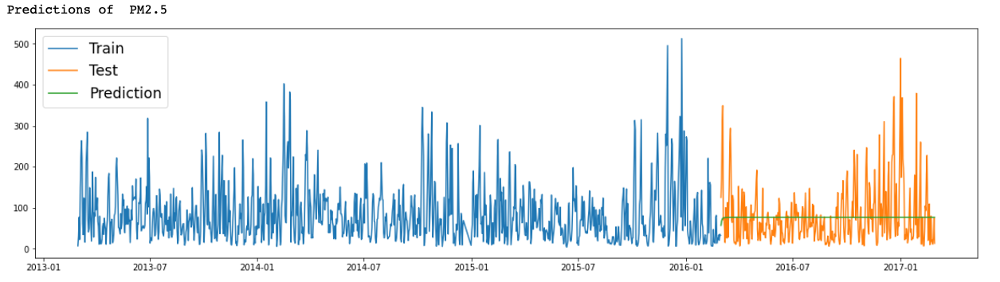
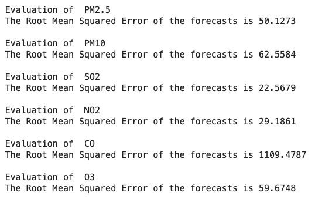
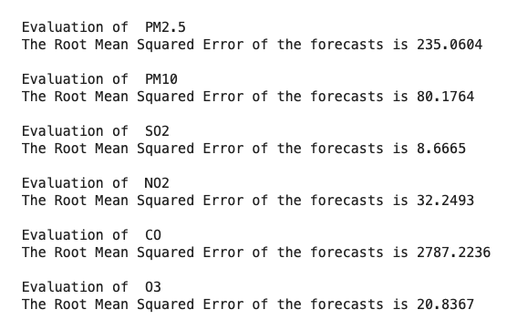

# "How fresh is the air? (Air Pollution Monitoring)

Prepared by: Stefan Angelov, Data Scientist
April 19, 2021

## Table of Contents

[Project Outline](#overview) 
[Background & Motivation](#motivation) 
[Problem](#problem) 
[Solution](#solution) 
[Goals](#problem) 
[Data](#solution) 
[Exploratory Data Analysis](#EDA) 
[Data Preparation](#data_preparation) 
[LSTM Model](#lstm) 
[Models Results](#results) 
[Summary](#summary) 
[Tools Used](#tools) 
[Next Steps](#next) 
[References](#references) 

## <a name="overview">Project Outline</a> ##

Predicting the air pollution level. 

Highly pollution days are pretty important for all the people but extremely important for those who have asthma or trouble of breathing or are sensitive to particular matter in the air. Can Data Science and Machine Learning helps us predict what those pollution could be? I build an early prediction model for air pollution using RNN- LSTM univariate and multivariate models for time series and successfully managed to predict two out of 6 main concentration in the air SO2 and O3 for a given month with RMSE 8.66 and 20.83 and not so good at daily base 13.81 and 43.60 respectivly.

## <a name="motivation">Background & Motivation</a> ##

I have a background in Economics and Healthcare in particular sunlight therapy and air purifying systems.

I am coming from one of the most air-polluted capital in the world Sofia. Now I am living in the Bay Area and enjoying the fresh and clean ocean air - when there are no fires. But I still take care of my friends and family. So I decided to create a system that can tell them few days in advance what the air quality will be. Maybe taking a vacation and go to the mountain, or maybe stay at how those days and enjoy the clean air from the home air purifying system.

So my motivation for the project stems from the fact that air pollution is responsible for 4 million deaths per year according to the World Health Organization (WHO) and is a leading cause of death across the globe, and contributes to stroke, heart disease, lung cancer, and other respiratory illness.
No wonder we should dedicate resources to understand and monitor air quality in our cities and neighborhoods. This should help authorities in urban planning as they can decide where to plant trees, build green spaces and manage traffic. Also, it can make us all aware of the impact of air pollution in our everyday life, which is critical to our health. 

California ever since 2018 they have been played wildfires, people evacuated.I remember last year was my second year living in the Bay Area and for the first time I had to experience the wildfires and this amount of toxic air. I have been waiting 3-4 days the air go better but this never happened so I decided to go to Utah for two weeks until the situation got better. If I knew in advance the quality of the air, I’ve might go earlier and prevent be exposed to pollution for those 4 days.

## <a name="problem">Problem</a> ##

Air pollution causes a lot of horrible diseases, slowly damaging your lungs and cardiovascular system. So if you a vulnerable you don’t want to get exposed to that. 

Statistically, nine out of ten people worldwide are exposed to high levels of air pollutants that lead to serious health problems. The simple act of breathing results in early deaths for millions of people and harms billions more. In fact, since the end of 2018, the WHO has dubbed air pollution the “new tobacco”, while the EU is calling it the “biggest environmental risk” to public health.

Due to the major consequences of air pollution on human health, this problem is resulting in a major public crisis that requires immediate attention. Nowadays, the prediction of air quality has been a potential research area. There exist several methods in the literature, but the focus of this work is based on the prediction of air quality using time series analysis. 

## <a name="solution">Solution</a> ##

A lot of big data have been collected in the past few years. The problem is not of the amount of data we have but rather the methods we use to forecast pollution.

## <a name="goals">Goals</a> ##

The goal of this project is to explore the air quality of the Beijing suburbs dataset and build a prototype model. My final goal is to apply the model on the air quality dataset for San Francisco.

## <a name="data">Data</a> ##

This Data set considers 6 main air pollutants and 6 relevant meteorological variables at multiple sites in Beijing. It covers the daily data between the years 2013 – 2017 for Beijing. Air quality data are collected at outdoor monitors across Beijing and can be download from UCI (UC Irvine Machine Learning Repository) web site https://archive.ics.uci.edu/ml/datasets/Beijing+Multi-Site+Air-Quality+Data

O3 (Ozone)

PM (Particle pollution or particulate matter)

CO (carbon monoxide)

SO2 (sulfur dioxide)

NO2 (nitrogen dioxide)

 

## <a name="EDA">Exploratory Data Analysis</a> ##

Conducted Exploratory Analysis and Visualization using Pandas and Seaborn on the Beijing PM2.5 Dataset
Scaled, encoded, and converted the Time Series data into Supervised Learning data to feed the LSTM network
Evaluated by combining the forecast with the test dataset, inverting the scaling, and achieving a test RMSE of 49.60 compare to the based model of 50.12.

This is a dataset that reports on the weather and the level of pollution each hour for five years at the US embassy in Beijing, China.

Because all the stations looked pretty similar to me, there is the same pattern going on, I just decided to predict the air pollution for only one station and the model can be easy applied to the others.

## <a name="data_preparation">Data Preparation</a> ##

My data collection process involves:

* After cleaning and itterpolating the data I resample it into daily by taking average of hours and monthly by taking monthly average of maximum values in a day.

* I broke the data into ¾ train test split, which means that the first 3 years are for train and the last one year for testing the model and see how it performed

* Shifted baseline to train from previous values

## <a name="lstm">LSTM Model</a> ##

My goal is to build a model to predict the PM2.5 and PM10(Particle pollution or particulate matter), SO2, NO2(nitrogen dioxide), CO(carbon monoxide),O3(sulfur dioxide) concentration in a given day or month.
So the model I’ve decided to build was LSTM which stands for long short term memory networks and it’s working extremely well to the time series data because instead of taking set period of time to train you model on, it’s getting constantly moving windows. 
It training on the previous 365 day to forecast the next day and training on the previous 12 months to forecast the next month.

The measure of success of this kind of model is RMSE Root mean squared error which we want ot be as small as possible because it measure the variance between what you predict and how the model actually performs.

* Daily base LSTM one to one model for PM2.5

* Daily base LSTM many to many model

* Monthly base LSTM one to one only for PM2.5

* Monthly base LSTM many to many for PM2.5, PM10, SO2, NO2, CO,O3

## <a name="results">Models Results</a> ##

My current methodology has been to build predictive models that use the air-quality dataset to minimize the RMSE(root mean square error). That metric will tell me how effective my model is at producing a prediction that a detected air is highly polluted.

Baseline Model for PM2.5 daily base

LSTM one to one for PM2.5 daily base

### Daily RMSE

Baseline Model

LSTM many to many

### Monthly RMSE

Baseline Model

LSTM many to many

I've got this results for monthly predicting. For SO2, O3 it predicts very well, but for PM2.5, PM10, NO2 CO it doesn't. 
It seems to predict very well when there is a clear seasonal pattern, if we look at SO2 there is a clear peak once a year and it seems to go slightly less each year. It’s start’s big 2014 and it’s less 2015 and the model is capturing that very well. The same is with O3 is predicting the seasonal trend. But is struggling with data and interestingly enough the CO prediction looks like they should be correct, there is a little bit of a pick at 2014 and 2015 and an even bigger pick in 2016 so predicted an even bigger pick in 2017 but it wasn’t. So I’ve read a little bit if China changed some regulation for CO emissions and it ends up that according to the US Energy Information Administration, China is ramping up its use of natural gas. Compared to coal, natural gas emits 50 to 60 percent less carbon during the combustion process. The predicting accurately got the trend of the increasing spikes. The model seems to make a sensible prediction based on the previous data. 

## <a name="summary">Summary</a> ##

This analysis has been carried out using univariate(one to one) and multivariate(many to many) techniques namely LSTM(long short term memory networks). To perform the experimental work, the dataset of Aotizhongxin has been considered because all the stations looked pretty similar to mine, the same pattern is repeating. 

Recurrent neural networks like the Long Short-Term Memory network or LSTM is a special kind of recurrent neural network capable of learning short-term dependencies and remembering information for long periods as its default behavior. I first conducted an LSTM one-to-one model for PM2.5 and after that many to many with 6 of the features.

As air quality has been improved and there are still pollutants (ozone, NO2, and PM2.5) retain at high AQI. Efforts should continuously be made to reduce them. How can we make a difference? Drive less, use less electricity, don't burn wood or trash, support measures in your community that can cut air pollution, etc.

## <a name="tools">Tools Used</a> ##

Python:
Data Gathering: Pandas
Data Analysis: Google Colab, Tensor Flow, Pandas, Scikit-Learn, NLTK

Visualization:
Data Visualization: Matplotlib

## <a name="next">Next Steps</a>
Potential future directions include the following:
* Including the weather data because the weather is highly correlated with pollution. I think that would be incredibly helpful in adding predictive power.
* Build a front-end, web page using a flask app that can show the prediction for end users.

## <a name="references">References</a> ##

Zhang, S., Guo, B., Dong, A., He, J., Xu, Z. and Chen, S.X. (2017) Cautionary Tales on Air-Quality Improvement in Beijing. Proceedings of the Royal Society A, Volume 473, No. 2205, Pages 20170457.

Citation Request:

Zhang, S., Guo, B., Dong, A., He, J., Xu, Z. and Chen, S.X. (2017) Cautionary Tales on Air-Quality Improvement in Beijing. Proceedings of the Royal Society A, Volume 473, No. 2205, Pages 20170457.