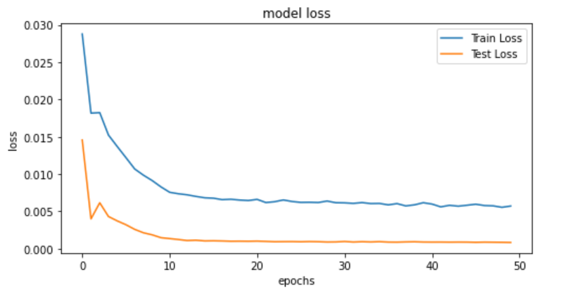
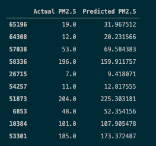

# Air-Pollution-Monitoring
Prepared for: Galvanize Immersive Program (DSI) Final Capstone Project

Prepared by: Stefan Angelov, Data Scientist
April 19, 2021

## Table of Contents

[Project Outline](#overview) 
[Background & Motivation](#motivation) 
[Problem](#problem) 
[Solution](#solution) 
[Goals](#problem) 
[Data](#solution) 
[Exploratory Data Analysis](#EDA) 
[Data_Preparation](#data_preparation) 
[LSTM Model](#lstm) 
[Models Results](#results) 
[Summary](#summary) 
[Next Steps](#next) 
[References](#references) 

## <a name="overview">Project Outline</a> ##

* What are you trying to do? 
Predicting the air pollution level. 
* Why?
Highly pollution days are pretty important for all the people but extremely important for those who have asthma or trouble of breathing or are sensitive to particular matter in the air. Can Data Science and Machine Learning helps us predict what those pollution could be?
* How is it done today, and what are the limits of current practice?
* What is new in your approach and why do you think it will be successful?
* Who cares? If you are successful, what difference will it make?
* What are the risks?
* How much will it cost?
* How long will it take?
* What are the mid-term and final “exams” to check for success?

* Using ........
* My results imply that in addition to

## <a name="motivation">Background & Motivation</a> ##
I have a background in Economics and Healthcare in particular sunlight therapy. 
My capstone project for the Galvanize Data Science Program was to build an early prediction model for air pollution.

I am coming from one of the most air polluted capital in the world Sofia. Now I am living at the Bay and enjoying the fresh and clean ocean air ‘when there are no fires’. But I still take care of my friends and family. So I decided to create a system that can tell them few days in advanced what the air quality will be. Maybe taking a vacation and go to the mountain, or maybe stay at how those days and enjoy the clean air from the home air purifying system.

So my motivation for the project stems from the fact that air pollution is responsible for 4 million deaths per year according to the World Health Organization (WHO) and is a leading cause of death across the globe, and contributes to stroke, heart disease, lung cancer, and other respiratory illness.
No wonder we should dedicate resources to understand and monitor air quality in our cities and neighborhoods. This should help authorities in urban planning as they can decide where to plant trees, build green spaces and manage traffic. Also, it can make us all aware of the impact of air pollution in our everyday life, which is critical to our health. 

A lot of big data have been collected in the past few years. The problem is not of the amount of data we have but rather the methods we use to forecast pollution.
The goal of this project is to explore the air quality of the Beijing suburbs.

## <a name="problem">Problem</a> ##

Air pollution is responsible for 4.2 million deaths per year according to the World Health Organization (WHO) . No wonder we should dedicate resources to understand and monitor air quality in our cities and neighborhoods. This should help authorities in urban planning as they can decide where to plant trees, build green spaces and manage traffic. Also, it can make us all aware of the impact of air pollution in our everyday life, which is critical to our health.

Air pollution cause a lot of horrible deceases, slowly messed up with your lungs and cardio vascular system. So if you a vulnerable you don’t want to get expose on that. 

Statistically, nine out of ten people worldwide are exposed to high levels of air pollutants that lead to serious health problems. The simple act of breathing results in early deaths for millions of people, and harms billions more. In fact, since the end of 2018, the WHO has dubbed air pollution the “new tobacco”, while the EU is calling it the “biggest environmental risk” to public health.

The California Ambient Air Monitoring Network consists of more than 250 monitoring stations operated by federal, State, and local agencies. The air monitoring data generated define the nature and severity of pollution in California, determine attainment status with Ambient Air Quality Standards, identify pollution trends, support agricultural burn forecasting, provide real-time air quality information, assess community exposure, and validate air quality models and emission inventories. 

Due to the major consequences of air pollution on human health, this problem is resulting in a major public crisis which requires immediate attention. Nowadays, the prediction of air quality has been a potential research area. There exist a number of methods in literature, but the focus of this work is based on the prediction of air quality using time series analysis. 

## <a name="solution">Solution</a> ##

In this project, I approach air pollution from a different angle. I want to introduce and discuss the concept of crowdsourcing air quality monitoring. For those unfamiliar with the concept of crowdsourcing, it is about engaging the public to achieve a common goal. We can achieve this by dividing the work among participants in small tasks; in this case, collect air quality measurements. My aim is to use crowdsourcing in a smart way to build up an accurate air pollution heat-map with the use of Artificial Intelligence (AI).

This Data set considers 6 main air pollutants and 6 relevant meteorological variables at multiple sites in Beijing.

## <a name="goals">Goals</a> ##

Starting prototype on the Beijin air quiality dataset but my ultimate goal is to apply the model on the air data quaility for San Francisco.
California ever since 2018 they have been played wildfires, people evacuated. Make sure the people can avoid the health risk. I remember last year it was my second year living at the Bay Area and for a first time I have experience the wildfires and this amount of toxic air. I have been waiting 3-4 days in order to air go better but this never happened so I decided to go to Utah for two weeks until the situation get better. If I knew in advanced the quality of the air, I’ve might gone earlier and prevent be exposed to the pollution for those 4 days.

## <a name="data">Data</a> ##

The datasets used in this project cover the daily data between year 2013 – 2017 for Beijing. Air quality data are  collected at outdoor monitors across the Beijin and can be download from UCI (UC Irvine Machine Learning Repository) web site https://archive.ics.uci.edu/ml/datasets/Beijing+Multi-Site+Air-Quality+Data

The AQI is an index for reporting daily air quality. It tells you how clean or polluted your air is, and what associated health effects might be a concern for you. The higher the AQI value, the greater the level of air pollution and the greater the health concern. Smaller AQI means better air quality.

EPA calculates the AQI for five major air pollutants regulated by the Clean Air Act:

Ozone
PM (Particle pollution or particulate matter)
CO (carbon monoxide)
SO2 (sulfur dioxide)
NO2 (nitrogen dioxide)
Therefore, in our data and visualiztion analysis, we will only be seeing the AQI of these pollutants. See Figure 1 for example of the data. And the Overall AQI is the maximum AQI among these pollutants (Overall AQI = max(Ozone, PM10, PM25, CO, SO2, NO2) ). Note that PM2.5 are not being monitored until late 1990's. Therefore there will be some missingness for PM25 variable.

EPA has divided AQI into six categories, which represent the level of air quality conditions. See Figure 2 below for the AQI ranges and corresponding air quality conditions.

 

## <a name="EDA">Exploratory Data Analysis</a> ##
Conducted Exploratory Analysis and Visualization using Pandas and Seaborn on the Beijing PM2.5 Dataset
Scaled, encoded and converted the Time Series data into a Supervised Learning data to feed the LSTM network
Evaluated by combining the forecast with the test dataset, inverting the scaling and achieving a test RMSE of 23.4
This is a dataset that reports on the weather and the level of pollution each hour for five years at the US embassy in Beijing, China.

From the begining I took one element that is extremely import most specifically PM2.5 pollution (particulars matter 2.5 microns or less) while ignoring some of the others then they use only one ML model. First simple regrassion analysis. Each machine learning model is special and it has upsides and downsides. RNN accurate but required so much data. Random Forest robust but tend to overfit. Take multi lateral approach and use multiple machine learning methodology.

  

## <a name="data_preparation">Data Preparation</a> ##

My data collection process involves first

## <a name="lstm">LSTM Model</a> ##
Long Short-Term Memory Networks (LSTMs)
Recurrent neural networks like the Long Short-Term Memory network or LSTM add the explicit handling of order between observations when learning a mapping function from inputs to outputs, not offered by MLPs or CNNs. They are a type of neural network that adds native support for input data comprised of sequences of observations.
This capability of LSTMs has been used to great effect in complex natural language processing problems.
The most relevant context of input observations to the expected output is learned and can change dynamically.

This analysis has been carried out using univariate and multivariate techniques namely LSTM(long short term memory networks). To perform the experimental work, the dataset of Aotizhongxin has been considered.

## <a name="results">Models Results</a> ##
My current methodology has been to build predictive models that use the air-quality dataset along with weather forecast because there is a correlation and to minimize the RMSE( root mean square error). That metric will tell me how effective my model is at producing a prediction that a detected air is actually high polluted.

I found the most effective the LSTM

## <a name="summary">Summary</a> ##
My results imply the following:
1. Generally my models predict

As air quality has been improved and there are still pollutants (Ozone, NO2, and PM2.5) retain at high AQI. Effort should continuously be made to reduce them. How can we make a difference? Drive less, use less electricity, don't burn wood or trash, support measures in your community that can cut air pollution, etc.

Also air quality continues to worsen in cities across the world, especially in low-income countries and developing countries.  Cooperation should be setup among countries in combating air pollution.

## <a name="next">Next Steps</a>
Potential future directions include the following:
* Including the weather data because weather is highly correlated with the pollution. I think that would be incredibly helpful in adding predictive power.
* Build a front-end, web page using a flask app that can show the prediction for end users.

## <a name="references">References</a> ##

Zhang, S., Guo, B., Dong, A., He, J., Xu, Z. and Chen, S.X. (2017) Cautionary Tales on Air-Quality Improvement in Beijing. Proceedings of the Royal Society A, Volume 473, No. 2205, Pages 20170457.

Citation Request:

Zhang, S., Guo, B., Dong, A., He, J., Xu, Z. and Chen, S.X. (2017) Cautionary Tales on Air-Quality Improvement in Beijing. Proceedings of the Royal Society A, Volume 473, No. 2205, Pages 20170457.